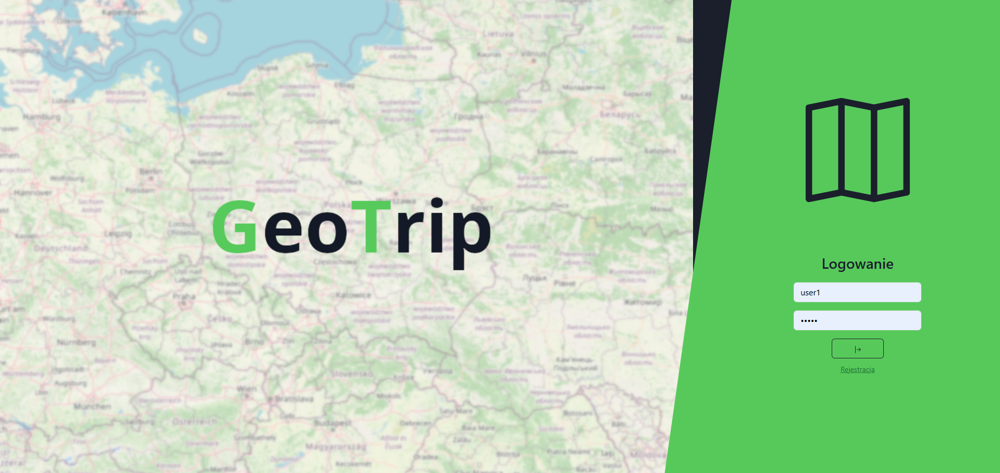
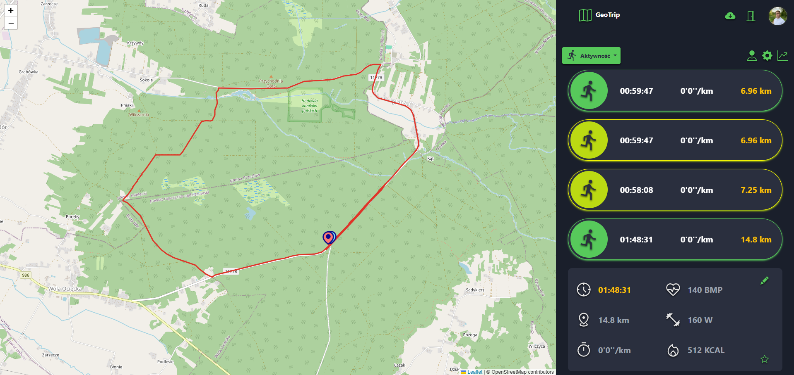
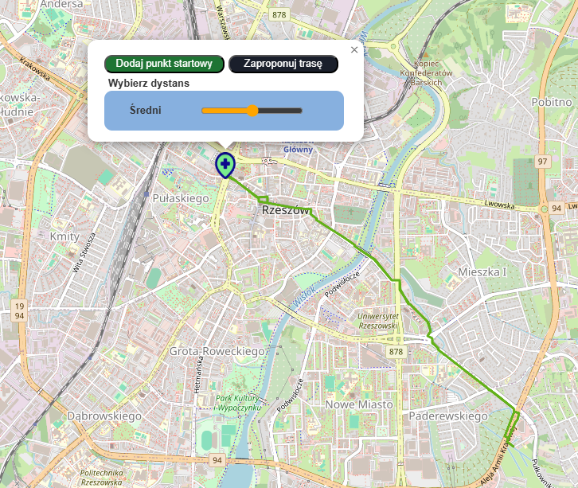
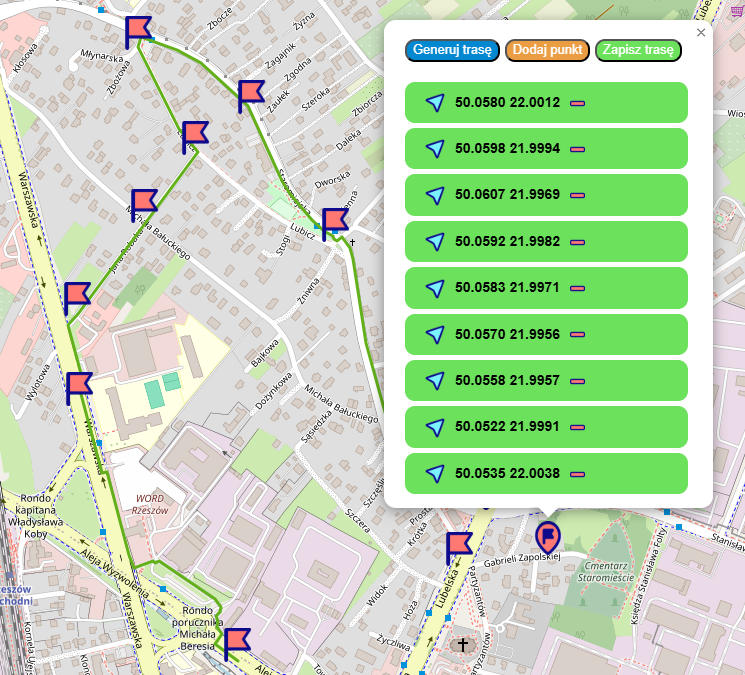
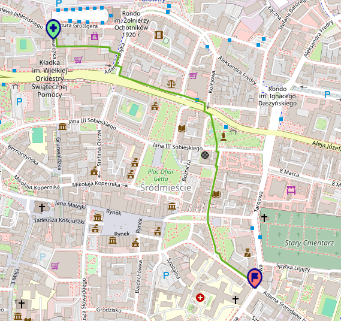

# 🗺️ GeoTrip 

Interaktywny planer treningów zintegrowany z mapami. Aplikacja łączy moc React.js oraz Spring Boot, wykorzystując MongoDB do gromadzenia danych o aktywnościach. System umożliwia intuicyjne wyznaczanie tras (bieganie, rower, marsz) przy użyciu API GraphHopper oraz dostarcza szczegółowych informacji o postępach użytkownika, motywując do systematycznego treningu.

## ✨ Kluczowe Funkcjonalności

* **🔐 Bezpieczeństwo z Keycloak** – Pełna obsługa logowania, rejestracji i odświeżania tokenów (JWT) poprzez serwer Keycloak.
* **GraphHopper** – Zaawansowane wyznaczanie tras z wykorzystaniem zewnętrznego API.
* **Interaktywna mapa** – Autorska implementacja mapy w komponencie `CustomMap.js`.
* **Zarządzanie treningami** – Możliwość dodanie własnego treningu poprzez zaplanowanie go na mapie lub użycie trasy wygenerowanej przez **GraphHopper**
* **Wgląd w statystyki** - Możliwość śledzenia postępów użytkownika na przygotowanych wykresach.
* **Importowanie tras z XML** – Dodawanie własnych tras z pliku `.xml `


## 🔧 Stack Technologiczny

### 💻 Frontend
* **⚛️React.js** 
* **🗺️GraphHopper API** 
* **📡Axios**
* **🎨Bootstrap Icons**
* **📈Recharts**


### ⚙️ Backend
* **☕Java & 🍃Spring Boot** 
* **🍃MongoDB** 
* **📦Maven** 

### 🔧 Narzędzia i Inne
* **🔐Keycloak** 
* **🐙Git** 
* **🚀Postman**
* **🐳Docker**
* **💻VS CODE**

## 📂 Struktura Projektu

Projekt korzysta z podziału na warstwę widoków oraz warstwę usług (logiki biznesowej):

* `src/pages/` – Główne widoki aplikacji (`MainPanel`, `LoginPage`, `RegisterPage`).
* `src/services/` – Moduły odpowiedzialne za komunikację z API (`api.js`, `graphhopper.service.js`, `auth.service.js`).
* `src/img/` – Zasoby graficzne i ikony wykorzystywane w aplikacji.


## 🔑 Podgląd ekranu logowania


## 🖥️ Podgląd ekranu głównego
Główny pulpit aplikacji został podzielony na dwie funkcjonalne sekcje:



* **Lewa strona (Mapa):** Interaktywny ekran mapy, na którym wizualizowane są trasy treningów oraz punkty nawigacyjne w czasie rzeczywistym.
* **Prawa strona (Panel sterowania):** Intuicyjny panel boczny, umożliwiający użytkownikowi zarządzanie parametrami treningu, filtrowanie danych oraz wykonywanie operacji na trasach.

## 📂 Import trasy z pliku XML

Proces importu trasy z pliku `.xml` odbywa się poprzez przeciągnięcie go na wyznaczone pole następnie trasa dodana zostanie do profilu użytkownika.


## 🗺️ Planowanie trasy

Aplikacja oferuje możliwość planowania tras treningu na podstawie wyboru długości dystansu bez konieczności podawania określonych ilości kilometrów tylko w oparciu o lużno zdefiniowane progi takie jak: `Krótki`, `Średni`, `Długi`.



Ponadto możemy ustalać trasę dodając kolejne punkty na mapie zgodnie z tym jak chcemy aby nasza trasa przebiegała.



Aplikacja również ma możliwość generowania trasy pomiędzy dwoma wyznaczonymi punktami.



## 📉 Wykresy i statystyki (w fazie implementacji)

Funkcjonalnością aktualnie wprowadzaną będzie prezentacja postępów użytkownika prezentowana w formie wykresów.

<video src="./src/img/wykresy.mp4" width="666" height="472" controls muted autoplay loop>
  Twoja przeglądarka nie obsługuje odtwarzania wideo.
</video>


## 🛠️ Instrukcja Uruchomienia

Aby uruchomić projekt lokalnie, wykonaj poniższe kroki:

1. **Sklonuj repozytorium:**
   ```bash
   git clone [https://github.com/lukas1299/geoTrip-frontend.git](https://github.com/lukas1299/geoTrip-frontend.git)
   cd geoTrip-frontend
   npm install 
   npm start 